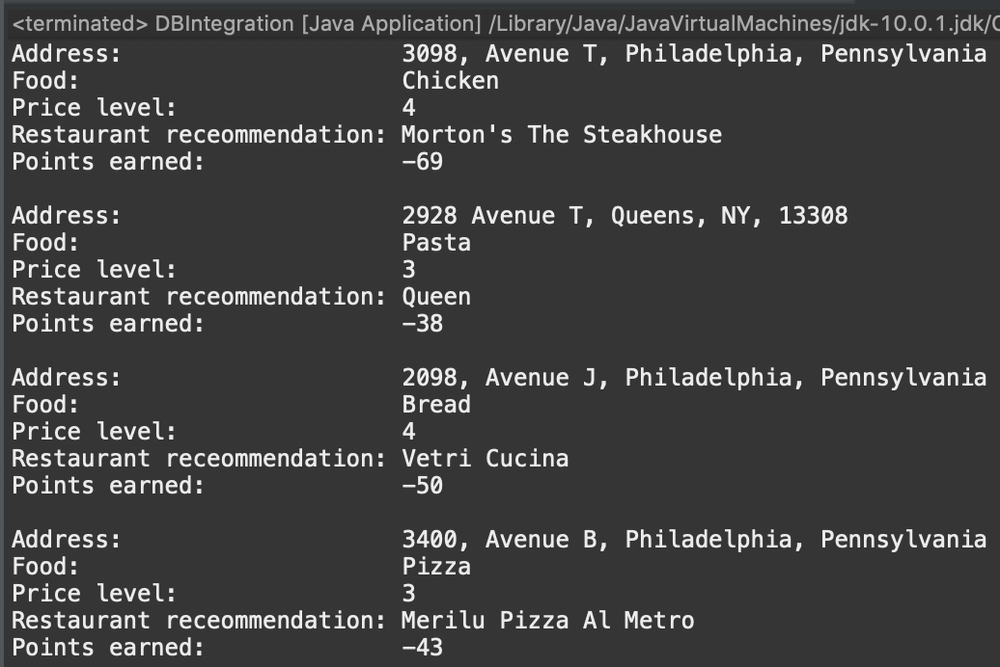

**Project name:** GoSave!

**Description:** GoSave! is a web application that gives our users the best restaurant recommendation for a particular food at their chosen price point and allows our users to earn points by saving and to compete with their friends on how much they saved. Points are normalized against average rating/price ratio of nearby restaurants for that particular type of food to ensure fairness
               
**Authors:**

Zhenghua (Calvin) Chen

Harrison Hur

Benny Thai

Jiawen (Ivy) Zhang
                       
**Link to GitHub repository:** https://github.com/calchen01/GoSave/

**User manual:**

GoSave! is a web application that people can use to compete with their friends see who save the most. We develop a leaderboard that rewards the user who spends their money on the most cost-efficient products. The first tab is where you can search for a specific food you want to eat and the price range you prefer, then the system would recommend the most cost-efficient restaurant near your location based on your needs. We reward the users points based on the performance/price ratio of the restaurants the users select. The second tab is where the users can see their cumulative points, which are updated once per day. In the third part, the users can compare their points with their friends to see who saves the most. We aim to use this ranking-based leadership board to motivate people to save more by reducing their unnecessary expenditure.

The back-end demo shows the results when you search a specific type of food.The system would recommend you the best restaurants along with their address, price level, food, and points earned/deducted if you select certain restaurants. The points are calculated based on the performance/price index we designed, which is equal to (rating/price of the restaurant - average rating/price of nearby restaurants_/average rating/price of nearby restaurants 
